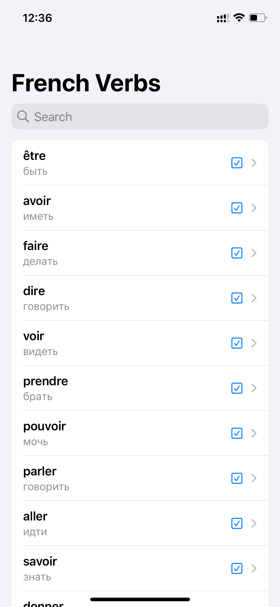

# conjugaison

My personal project, still in development. It uses a local database with 6,000 to 7,000 French verbs and their conjugations. It also includes a list of the 1,000 most common verbs with infinitive translations. Visual icons represent verb tenses.

  
  
  
  

